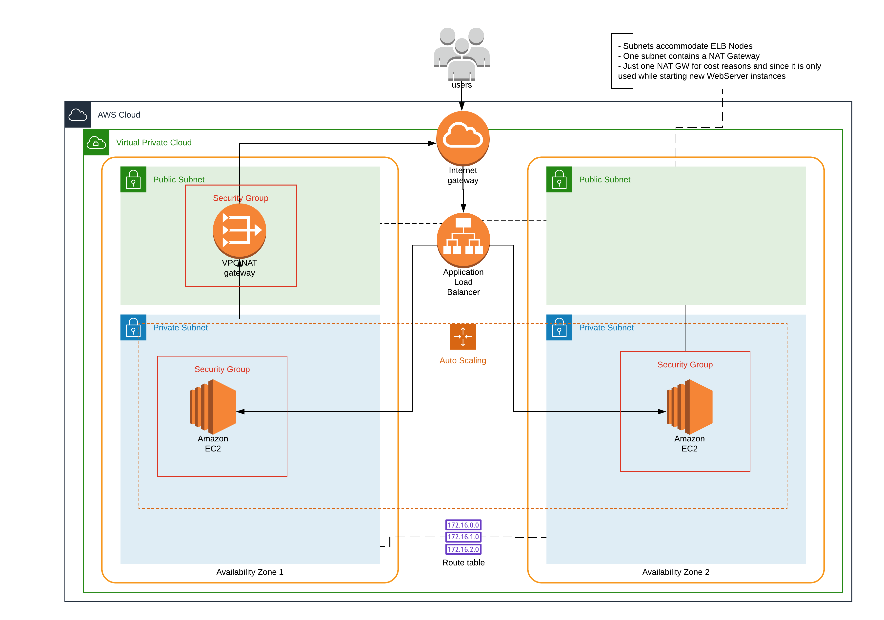

# Bertelsmann Technology Scholarship - Udacity 'Cloud DevOps Engineer' Nanodegree

## Assignment for Project 2 - Deploy a high-availability web app using CloudFormation

In order to create the infrastructure the provided script `./create-infrastructure.sh` can be used.
The script uses the aws cli to setup the infrastructure using the cloudformation script `infrastructure.yml`
in the default region using parameters supplied in `parameters.json`

     aws cloudformation create-stack 
       --stack-name nanodegree-webapp 
       --template-body file://infrastructure.yaml 
       --parameters file://parameters.json 
       --capabilities CAPABILITY_NAMED_IAM

The infrastructure deployed by infrastructure.yml looks like this :

